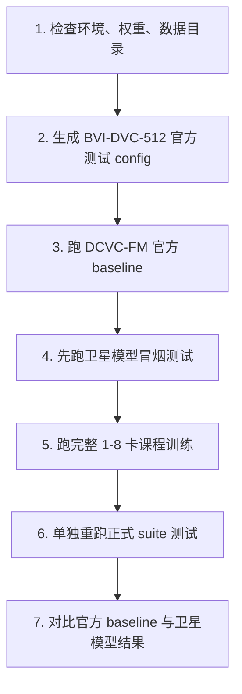

# BVI-DVC-512 训练与测试顺序方案

本文档是当前项目唯一推荐方案。它针对你现有的数据结构：

```text
/data/sdb/bitqzh/data/BVI-DVC-512/
├── train/
│   ├── video_folder_001/
│   │   ├── *.png
│   │   └── ...
│   └── ...
├── val/
│   ├── video_folder_xxx/
│   │   ├── *.png
│   │   └── ...
│   └── ...
└── metadata.json
```

从你给出的 `metadata.json` 可知：

- 图像尺寸：`512x512`；
- 已经中心裁剪为 512；
- `train_videos=3592`；
- `val_videos=408`，实际目录名为 `val`；
- 每个 crop 视频约 `64` 帧；
- 数据已经完成 train/val 划分，不需要重新随机划分。

因此后续方案固定为：

- 训练数据：`/data/sdb/bitqzh/data/BVI-DVC-512/train`；
- 验证/测试数据：`/data/sdb/bitqzh/data/BVI-DVC-512/val`；
- 训练裁剪：`256x256`；
- 正式评估：`512x512`；
- 官方 DCVC-FM baseline：使用 val split 的 PNG 配置；
- 卫星模型正式 checkpoint：使用 `best.pt`。

## 总运行顺序

必须按下面顺序执行：



## 1. 检查环境、权重、数据

进入项目：

```bash
cd ~/FM/DCVC/DCVC-family/DCVC-FM
conda activate Page1
```

检查 GPU：

```bash
python -c "import torch; print(torch.__version__, torch.cuda.is_available(), torch.cuda.device_count())"
```

检查官方 DCVC-FM 权重：

```bash
ls checkpoints/cvpr2024_image.pth.tar
ls checkpoints/cvpr2024_video.pth.tar
```

检查数据目录：

```bash
ls /data/sdb/bitqzh/data/BVI-DVC-512
ls /data/sdb/bitqzh/data/BVI-DVC-512/train | head
ls /data/sdb/bitqzh/data/BVI-DVC-512/val | head
```

建议编译 motion compensation CUDA 扩展，避免 fallback 到慢速 `grid_sample`：

```bash
cd src/models/extensions
python setup.py build_ext --inplace
cd ../../..
```

如果这里失败，模型仍可运行，只是速度明显变慢。

## 2. 生成官方测试 config

你的数据已经是 PNG 帧目录，但 DCVC-FM 官方 `test_video.py` 的 `PNGReader` 要求帧名是 `im00001.png` 或 `im1.png`。为了避免原始 PNG 命名不兼容，使用下面脚本生成一个标准命名的 val symlink 视图和官方 RGB config。

运行：

```bash
python tools/prepare_bvidvc512.py \
  --input_root /data/sdb/bitqzh/data/BVI-DVC-512 \
  --work_root /data/sdb/bitqzh/data/BVI-DVC-512_dcvcfm \
  --source_type png \
  --existing_split \
  --train_dir_name train \
  --val_dir_name val \
  --width 512 \
  --height 512 \
  --eval_frames 64 \
  --split_mode symlink \
  --overwrite
```

输出：

```text
/data/sdb/bitqzh/data/BVI-DVC-512_dcvcfm/
├── configs/
│   └── bvidvc512_rgb.json
├── official_rgb/
│   └── val/
│       ├── video_folder_xxx/
│       │   ├── im00001.png -> 原始 PNG
│       │   └── ...
│       └── ...
└── manifest.json
```

说明：

- 这一步不会重新划分 train/val；
- 训练仍直接使用原始 `/data/sdb/bitqzh/data/BVI-DVC-512`；
- `official_rgb/val` 只给官方 `test_video.py` 用；
- `eval_frames=64` 与 `metadata.json` 中每个视频 64 帧一致。

## 3. 跑 DCVC-FM 官方 baseline

这一步用于确认官方 DCVC-FM 权重在你的 BVI-DVC-512 val split 上正常。不要使用 `dataset_config_example_yuv420.json`，它指向 UVG/HEVC 示例路径。

运行：

```bash
mkdir -p results

python test_video.py \
  --model_path_i checkpoints/cvpr2024_image.pth.tar \
  --model_path_p checkpoints/cvpr2024_video.pth.tar \
  --rate_num 4 \
  --test_config /data/sdb/bitqzh/data/BVI-DVC-512_dcvcfm/configs/bvidvc512_rgb.json \
  --cuda 1 \
  --worker 1 \
  --write_stream 0 \
  --output_path results/bvidvc512_dcvcfm_official_rgb.json \
  --force_intra_period 9999 \
  --force_frame_num 64
```

如果你想用多 GPU 加速官方 baseline：

```bash
CUDA_VISIBLE_DEVICES=0,1,2,3 python test_video.py \
  --model_path_i checkpoints/cvpr2024_image.pth.tar \
  --model_path_p checkpoints/cvpr2024_video.pth.tar \
  --rate_num 4 \
  --test_config /data/sdb/bitqzh/data/BVI-DVC-512_dcvcfm/configs/bvidvc512_rgb.json \
  --cuda 1 \
  --worker 4 \
  --write_stream 0 \
  --output_path results/bvidvc512_dcvcfm_official_rgb.json \
  --force_intra_period 9999 \
  --force_frame_num 64
```

成功后检查：

```bash
ls results/bvidvc512_dcvcfm_official_rgb.json
```

这一步成功后再训练卫星模型。

## 4. 先跑卫星模型冒烟测试

目的：确认数据读取、checkpoint 保存、多阶段串联、正式测试入口都能跑通。先用很少 step，不追求质量。

单卡冒烟：

```bash
SLOT_STEPS=20 SELECTION_STEPS=20 CAPACITY_STEPS=20 ROBUST_STEPS=20 JOINT_STEPS=20 \
bash run_dcvcfm_satellite_curriculum_8gpu.sh \
  --data-root /data/sdb/bitqzh/data/BVI-DVC-512 \
  --model-i checkpoints/cvpr2024_image.pth.tar \
  --model-p checkpoints/cvpr2024_video.pth.tar \
  --ngpu 1 \
  --result-root results/dcvcfm_satellite_smoke
```

成功后应看到：

```text
checkpoints/dcvcfm_satellite_curriculum/05_joint_finetune/best.pt
results/dcvcfm_satellite_smoke/suite_summary.json
```

如果冒烟测试失败，先修错误，不要直接跑完整训练。

## 5. 跑完整课程训练

8 卡推荐命令：

```bash
bash run_dcvcfm_satellite_curriculum_8gpu.sh \
  --data-root /data/sdb/bitqzh/data/BVI-DVC-512 \
  --model-i checkpoints/cvpr2024_image.pth.tar \
  --model-p checkpoints/cvpr2024_video.pth.tar \
  --ngpu 8 \
  --result-root results/dcvcfm_satellite_curriculum
```

4 卡命令：

```bash
bash run_dcvcfm_satellite_curriculum_8gpu.sh \
  --data-root /data/sdb/bitqzh/data/BVI-DVC-512 \
  --model-i checkpoints/cvpr2024_image.pth.tar \
  --model-p checkpoints/cvpr2024_video.pth.tar \
  --ngpu 4 \
  --result-root results/dcvcfm_satellite_curriculum
```

该脚本会按顺序自动运行：

1. `baseline`：关闭卫星路径，检查 wrapper；
2. `slot_warmup`：按 Slot Attention 官方 object discovery 范式预热；
3. `selection_warmup`：identity channel 下训练语义 token selection；
4. `capacity_calibration`：成对带宽训练，约束 bpp/keep ratio 单调；
5. `robust_curriculum`：加入 satellite channel，训练 SNR/BW/PLR 鲁棒性；
6. `joint_finetune`：小学习率解冻少量 DCVC-FM 后端模块；
7. `evaluate_dcvcfm_satellite_suite`：用 `best.pt` 做正式测试。

最终 checkpoint：

```text
checkpoints/dcvcfm_satellite_curriculum/05_joint_finetune/best.pt
```

不要用：

```text
final.pt
```

## 6. 单独重跑正式测试

完整训练结束后，如果只想重新评估，不需要重训：

```bash
CUDA_VISIBLE_DEVICES=0 python -m training.evaluate_dcvcfm_satellite_suite \
  --data_dir /data/sdb/bitqzh/data/BVI-DVC-512/val \
  --ckpt checkpoints/dcvcfm_satellite_curriculum/05_joint_finetune/best.pt \
  --model_path_i checkpoints/cvpr2024_image.pth.tar \
  --model_path_p checkpoints/cvpr2024_video.pth.tar \
  --channel_type satellite \
  --img_h 512 \
  --img_w 512 \
  --clip_len 7 \
  --batch_size 1 \
  --num_workers 6 \
  --output_dir results/dcvcfm_satellite_curriculum
```

测试覆盖：

- tier scan：outage / poor / medium / good；
- bandwidth scan：1 / 2 / 5 / 10 / 20 / 25 Mbps；
- SNR scan：1 / 5 / 10 / 15 / 20 dB；
- PLR scan：0 / 0.05 / 0.1 / 0.2 / 0.3 / 0.5。

输出主文件：

```text
results/dcvcfm_satellite_curriculum/suite_summary.json
```

## 7. 结果检查顺序

### 7.1 官方 baseline

先看：

```text
results/bvidvc512_dcvcfm_official_rgb.json
```

确认所有 rate point 有结果，PSNR/bpp 正常。

### 7.2 卫星模型总表

再看：

```text
results/dcvcfm_satellite_curriculum/suite_summary.json
```

重点字段：

```text
diagnostics.bandwidth.bpp_monotonic_violations
diagnostics.bandwidth.keep_monotonic_violations
diagnostics.bandwidth.bpp_bw_max_over_min
```

要求：

- `bpp_monotonic_violations` 为 0 或极少；
- `keep_monotonic_violations` 为 0；
- `bpp_bw_max_over_min > 2.5`。

### 7.3 高带宽质量

看：

```text
tiers/good
bandwidth/bw_20
bandwidth/bw_25
```

要求：

- `SNR=20, BW=20/25, PLR=0` 时 PSNR 接近官方 DCVC-FM baseline；
- 如果高带宽仍明显低，优先缩短 joint finetune 或降低 `lambda_monotonic`。

### 7.4 低带宽降级

看：

```text
bandwidth/bw_1
bandwidth/bw_2
```

要求：

- base layer ratio 有效；
- enhancement layer ratio 明显低于高带宽；
- 图像可识别，不应完全崩溃。

### 7.5 PLR 鲁棒性

看：

```text
plr/plr_0.3
plr/plr_0.5
```

要求：

- `PLR=0.3` 不严重花屏；
- `PLR=0.5` 有 fallback 质量。

## 8. 常见问题

### 为什么还要运行 prepare 脚本？

不是为了重新划分数据，而是为了给 DCVC-FM 官方 `test_video.py` 生成兼容 config，并创建 `im00001.png` 标准命名 symlink。卫星训练脚本直接读取原始 `train/val`，不依赖这个 symlink 目录。

### 找不到 UVG 文件

说明你误用了官方示例 config。不要再用：

```text
dataset_config_example_yuv420.json
```

应使用：

```text
/data/sdb/bitqzh/data/BVI-DVC-512_dcvcfm/configs/bvidvc512_rgb.json
```

### 显存不足

优先降低训练裁剪尺寸，正式测试仍保持 512：

```bash
bash run_dcvcfm_satellite_curriculum_8gpu.sh \
  --data-root /data/sdb/bitqzh/data/BVI-DVC-512 \
  --ngpu 8 \
  --train-img-h 192 \
  --train-img-w 192
```

### 多卡卡住

- 不要加 `--amp`；
- 确认所有 GPU 进程都能访问 `/data/sdb/bitqzh/data/BVI-DVC-512`；
- 主脚本已经使用 `torchrun --standalone`；
- 同机多任务时设置 `CUDA_VISIBLE_DEVICES`。

### 训练太慢

- 编译 motion compensation CUDA 扩展；
- 使用 `--ngpu 8`；
- `--num-workers 6` 或 `8`；
- 确保数据在本地 SSD/NVMe。
