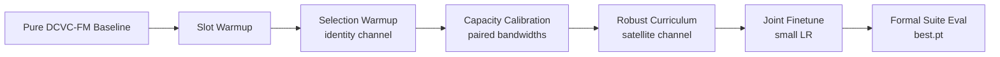

# DCVC-FM Satellite Curriculum Training Plan

This is the recommended training and testing plan for the satellite-aware
DCVC-FM model.  It replaces the coarse A/B/C recipe for main experiments while
keeping the original DCVC-FM codec and bitstream path independently runnable.

## Why This Curriculum

The satellite model has three learning problems that should not be optimized
from scratch at the same time:

- object discovery: Slot Attention must first learn stable masks and slot
  embeddings from video frames;
- semantic selection: residual magnitude, novelty, object importance, and
  temporal uncertainty must learn how to rank latent positions;
- channel robustness: base/enhancement latents must survive SNR, bandwidth, and
  packet-loss variation without forcing every condition to a low-rate solution.

The curriculum separates these problems, then reconnects them for final
low-learning-rate tuning.



## Phase 0: Baseline Check

Goal: verify that the wrapper can reproduce the original DCVC-FM path when the
satellite branch is disabled.

Trainable parameters: none.

Command:

```bash
cd DCVC-family/DCVC-FM
python -m training.train_dcvcfm_satellite_curriculum \
  --phase baseline \
  --data_dir /path/to/frame_dataset \
  --model_path_i checkpoints/cvpr2024_image.pth.tar \
  --model_path_p checkpoints/cvpr2024_video.pth.tar \
  --save_dir checkpoints/dcvcfm_satellite_curriculum/00_baseline \
  --max_steps 0
```

Expected result: `best.pt` and `final.pt` are saved, and validation reports
`keep_ratio=1`, `base_layer_ratio=1`, `enhancement_layer_ratio=0`.

## Phase 1: Slot Warmup

Goal: train the Slot Attention adapter before it controls any DCVC latent.

Trainable parameters: `slot_adapter` only.  The Slot Attention implementation is
the PyTorch compatibility layer of the official Slot Attention code located at
`DCVC-family/slot-attention/model.py`; it is not a newly invented slot module.

Loss:

```text
L_slot =
  lambda_slot * (image_reconstruction + mask_entropy + mask_balance)
+ lambda_slot_temporal * object_importance_temporal_stability
```

Command:

```bash
python -m training.train_dcvcfm_satellite_curriculum \
  --phase slot_warmup \
  --channel_type identity \
  --data_dir /path/to/frame_dataset \
  --model_path_i checkpoints/cvpr2024_image.pth.tar \
  --model_path_p checkpoints/cvpr2024_video.pth.tar \
  --save_dir checkpoints/dcvcfm_satellite_curriculum/01_slot_warmup \
  --lr 2e-4 \
  --max_steps 30000
```

Validation gate: slot reconstruction PSNR should improve, mask entropy should
not collapse to one slot, and masks should visibly correspond to object or
region structure on held-out clips.

## Phase 2: Selection Warmup

Goal: train Slot/Token/Capacity adapters with no channel corruption so the
selector learns useful differentiable latent ranking.

Trainable parameters: Slot Attention adapter, token selector, capacity
controller offsets, and slot-to-latent FiLM.  DCVC-FM backbone is frozen.

Channel: `identity`.

Condition sampling: random bandwidth from `1,2,5,10,20,25 Mbps`, high SNR,
zero PLR.

Command:

```bash
python -m training.train_dcvcfm_satellite_curriculum \
  --phase selection_warmup \
  --channel_type identity \
  --resume checkpoints/dcvcfm_satellite_curriculum/01_slot_warmup/best.pt \
  --data_dir /path/to/frame_dataset \
  --model_path_i checkpoints/cvpr2024_image.pth.tar \
  --model_path_p checkpoints/cvpr2024_video.pth.tar \
  --save_dir checkpoints/dcvcfm_satellite_curriculum/02_selection_warmup \
  --lr 1e-4 \
  --max_steps 50000
```

Validation gate: high-bandwidth conditions should not lose much quality versus
baseline, and low-bandwidth conditions should reduce enhancement usage first.

## Phase 3: Capacity Calibration

Goal: prevent the model from learning "always save bitrate" by training paired
bandwidth samples in the same optimization step.

Trainable parameters: same as Phase 2.

Channel: `identity`.

Condition construction: each clip is repeated over `1,2,5,10,20,25 Mbps` at
`SNR=20 dB`, `PLR=0`.

Extra loss:

```text
L_mono = ReLU(bpp_low - bpp_high) + ReLU(keep_low - keep_high)
```

Command:

```bash
python -m training.train_dcvcfm_satellite_curriculum \
  --phase capacity_calibration \
  --channel_type identity \
  --resume checkpoints/dcvcfm_satellite_curriculum/02_selection_warmup/best.pt \
  --data_dir /path/to/frame_dataset \
  --model_path_i checkpoints/cvpr2024_image.pth.tar \
  --model_path_p checkpoints/cvpr2024_video.pth.tar \
  --save_dir checkpoints/dcvcfm_satellite_curriculum/03_capacity_calibration \
  --lr 8e-5 \
  --lambda_monotonic 0.5 \
  --max_steps 30000
```

Validation gate: bandwidth scan should have near-monotonic `bpp` and
`keep_ratio`; BW25/BW1 bpp ratio should ideally exceed `2.5`.

## Phase 4: Robust Curriculum

Goal: train the frozen-backbone adapter path under actual satellite impairments.

Trainable parameters: same as Phase 2.

Channel: `satellite`.

Condition sampling: SNR/PLR range is widened during training.  Early steps use
moderate conditions, late steps sample the full range:

- SNR: progressively down to `1 dB`;
- bandwidth: `1-25 Mbps`;
- PLR: progressively up to `0.5`.

Command:

```bash
python -m training.train_dcvcfm_satellite_curriculum \
  --phase robust_curriculum \
  --channel_type satellite \
  --resume checkpoints/dcvcfm_satellite_curriculum/03_capacity_calibration/best.pt \
  --data_dir /path/to/frame_dataset \
  --model_path_i checkpoints/cvpr2024_image.pth.tar \
  --model_path_p checkpoints/cvpr2024_video.pth.tar \
  --save_dir checkpoints/dcvcfm_satellite_curriculum/04_robust_curriculum \
  --lr 6e-5 \
  --lambda_channel 0.08 \
  --max_steps 80000
```

Validation gate: `PLR=0.3` should remain recognizable without strong artifacts;
`PLR=0.5` should fall back gracefully through the base layer.

## Phase 5: Joint Finetune

Goal: adapt selected DCVC-FM feature modulation, prior fusion, quantization
scalers, and decoder layers with a small learning rate.

Trainable parameters:

- all adapter parameters;
- `feature_adaptor*`;
- contextual decoder and reconstruction generation;
- temporal/y prior fusion modules;
- quantization scaler parameters.

Command:

```bash
python -m training.train_dcvcfm_satellite_curriculum \
  --phase joint_finetune \
  --channel_type satellite \
  --resume checkpoints/dcvcfm_satellite_curriculum/04_robust_curriculum/best.pt \
  --data_dir /path/to/frame_dataset \
  --model_path_i checkpoints/cvpr2024_image.pth.tar \
  --model_path_p checkpoints/cvpr2024_video.pth.tar \
  --save_dir checkpoints/dcvcfm_satellite_curriculum/05_joint_finetune \
  --lr 1e-5 \
  --lambda_channel 0.05 \
  --lambda_monotonic 0.25 \
  --max_steps 30000
```

Validation gate: high-bandwidth clean quality should stay close to the pure
DCVC-FM baseline, while bandwidth and PLR response should remain clear.

## One-Command Run

The helper script chains all phases and evaluates the final `best.pt`:

```bash
bash run_dcvcfm_satellite_curriculum.sh \
  --data-root /path/to/frame_dataset \
  --model-i checkpoints/cvpr2024_image.pth.tar \
  --model-p checkpoints/cvpr2024_video.pth.tar
```

You can override phase lengths through environment variables:

```bash
SLOT_STEPS=1000 SELECTION_STEPS=2000 CAPACITY_STEPS=1000 ROBUST_STEPS=2000 JOINT_STEPS=1000 \
bash run_dcvcfm_satellite_curriculum.sh --data-root /path/to/frame_dataset
```

## Formal Evaluation

Use `best.pt`, not `final.pt`, for the formal suite:

```bash
python -m training.evaluate_dcvcfm_satellite_suite \
  --data_dir /path/to/frame_dataset/val \
  --ckpt checkpoints/dcvcfm_satellite_curriculum/05_joint_finetune/best.pt \
  --model_path_i checkpoints/cvpr2024_image.pth.tar \
  --model_path_p checkpoints/cvpr2024_video.pth.tar \
  --channel_type satellite \
  --output_dir results/dcvcfm_satellite_curriculum \
  --disable_lpips \
  --disable_dists
```

The suite evaluates:

- tiers: outage, poor, medium, good;
- bandwidth scan: `1 / 2 / 5 / 10 / 20 / 25 Mbps`;
- SNR scan: `1 / 5 / 10 / 15 / 20 dB`;
- PLR scan: `0 / 0.05 / 0.1 / 0.2 / 0.3 / 0.5`.

Output:

- per-condition `eval_results.json`;
- top-level `suite_summary.json`;
- bandwidth diagnostics: monotonic violations and BW25/BW1 bpp ratio;
- PLR diagnostics: quality trend and presence of `PLR=0.3/0.5` cases.

Dry run:

```bash
python -m training.evaluate_dcvcfm_satellite_suite \
  --data_dir /path/to/frame_dataset/val \
  --dry_run \
  --output_dir results/dcvcfm_satellite_curriculum_dryrun
```

## Acceptance Checks

Use `results/dcvcfm_satellite_curriculum/suite_summary.json`.

High-bandwidth quality:

- inspect `tiers/good` and bandwidth `bw_20`, `bw_25`;
- PSNR should be close to the pure DCVC-FM baseline;
- obvious collapse at `SNR=20`, `BW=20/25`, `PLR=0` means the adapter is too
  aggressive or joint fine-tune overfit to rate reduction.

Bandwidth response:

- `diagnostics.bandwidth.bpp_monotonic_violations` should be `0` or very small;
- `diagnostics.bandwidth.keep_monotonic_violations` should be `0`;
- `diagnostics.bandwidth.bpp_bw_max_over_min` should ideally be `> 2.5`;
- PSNR should generally rise with bandwidth.

Low-bandwidth graceful degradation:

- `bw_1` and `bw_2` should mainly use base latents;
- reconstruction may be lower quality, but should remain recognizable.

Satellite robustness:

- PLR `0.3` should avoid severe artifacts;
- PLR `0.5` should preserve fallback/base-layer structure.

## Notes

- `train_dcvcfm_satellite_curriculum.py` saves the initialized model as
  `best.pt` before training updates, so early degradation cannot erase the
  starting baseline.
- AMP is opt-in with `--amp`; fp32 is the default because DCVC-FM entropy/bit
  estimation can be numerically sensitive.
- The selector uses straight-through top-k: hard masks in the forward pass and
  soft relaxation in the backward pass. Slot and selector parameters therefore
  receive gradients from reconstruction and rate losses.
- The current latent dropping is a research proxy over decoded latents, not a
  finalized entropy-coded base/enhancement bitstream format.
