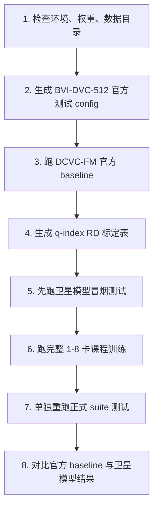

# BVI-DVC-512 训练与测试顺序方案

> **唯一推荐训练入口**：`training/train_dcvcfm_satellite_curriculum.py`（课程式，5 阶段）。
> 旧的 A/B/C 脚本 `training/train_dcvcfm_satellite.py` **已废弃**，仅保留兼容；其默认值
> 已同步为新方案（Slot FiLM 默认开、`q_index_mode=rd_table`、`lambda_rate_budget=0`），
> 但不再推荐用于正式实验。评估统一用 `evaluate_dcvcfm_satellite_suite.py`。

本文档是当前项目唯一推荐方案。它针对你现有的数据结构：

```text
/data/sdb/bitqzh/data/BVI-DVC-512/
├── train/
│   ├── video_folder_001/
│   │   ├── *.png
│   │   └── ...
│   └── ...
├── val/
│   ├── video_folder_xxx/
│   │   ├── *.png
│   │   └── ...
│   └── ...
└── metadata.json
```

从你给出的 `metadata.json` 可知：

- 图像尺寸：`512x512`；
- 已经中心裁剪为 512；
- `train_videos=3592`；
- `val_videos=408`，实际目录名为 `val`；
- 每个 crop 视频约 `64` 帧；
- 数据已经完成 train/val 划分，不需要重新随机划分。

因此后续方案固定为：

- 训练数据：`/data/sdb/bitqzh/data/BVI-DVC-512/train`；
- 验证/测试数据：`/data/sdb/bitqzh/data/BVI-DVC-512/val`；
- 训练裁剪：`256x256`；
- 正式评估：`512x512`；
- 官方 DCVC-FM baseline：使用 val split 的 PNG 配置；
- 卫星模型正式 checkpoint：使用 `best.pt`。

## 总运行顺序

必须按下面顺序执行：



## 1. 检查环境、权重、数据

进入项目：

```bash
cd ~/FM/DCVC/DCVC-family/DCVC-FM
conda activate Page1
```

检查 GPU：

```bash
python -c "import torch; print(torch.__version__, torch.cuda.is_available(), torch.cuda.device_count())"
```

检查官方 DCVC-FM 权重：

```bash
ls checkpoints/cvpr2024_image.pth.tar
ls checkpoints/cvpr2024_video.pth.tar
```

检查数据目录：

```bash
ls /data/sdb/bitqzh/data/BVI-DVC-512
ls /data/sdb/bitqzh/data/BVI-DVC-512/train | head
ls /data/sdb/bitqzh/data/BVI-DVC-512/val | head
```

安装 Python 依赖：

```bash
pip install -r requirements.txt
```

推荐仍按官方 README 先用 conda 安装 CUDA 版 PyTorch：

```bash
conda install pytorch==2.0.0 torchvision==0.15.0 torchaudio==2.0.0 pytorch-cuda=11.8 -c pytorch -c nvidia
pip install -r requirements.txt
```

建议编译 motion compensation CUDA 扩展，避免 fallback 到慢速 `grid_sample`：

```bash
cd src/models/extensions
python setup.py build_ext --inplace
cd ../../..
```

如果这里失败，模型仍可运行，只是速度明显变慢。

## 2. 生成官方测试 config

你的数据已经是 PNG 帧目录，但 DCVC-FM 官方 `test_video.py` 的 `PNGReader` 要求帧名是 `im00001.png` 或 `im1.png`。为了避免原始 PNG 命名不兼容，使用下面脚本生成一个标准命名的 val symlink 视图和官方 RGB config。

运行：

```bash
python tools/prepare_bvidvc512.py \
  --input_root /data/sdb/bitqzh/data/BVI-DVC-512 \
  --work_root /data/sdb/bitqzh/data/BVI-DVC-512_dcvcfm \
  --source_type png \
  --existing_split \
  --train_dir_name train \
  --val_dir_name val \
  --width 512 \
  --height 512 \
  --eval_frames 64 \
  --split_mode symlink \
  --overwrite
```

输出：

```text
/data/sdb/bitqzh/data/BVI-DVC-512_dcvcfm/
├── configs/
│   └── bvidvc512_rgb.json
├── official_rgb/
│   └── val/
│       ├── video_folder_xxx/
│       │   ├── im00001.png -> 原始 PNG
│       │   └── ...
│       └── ...
└── manifest.json
```

说明：

- 这一步不会重新划分 train/val；
- 训练仍直接使用原始 `/data/sdb/bitqzh/data/BVI-DVC-512`；
- `official_rgb/val` 只给官方 `test_video.py` 用；
- `eval_frames=64` 与 `metadata.json` 中每个视频 64 帧一致。

## 3. 跑 DCVC-FM 官方 baseline

这一步用于确认官方 DCVC-FM 权重在你的 BVI-DVC-512 val split 上正常。不要使用 `dataset_config_example_yuv420.json`，它指向 UVG/HEVC 示例路径。

运行：

```bash
mkdir -p results

python test_video.py \
  --model_path_i checkpoints/cvpr2024_image.pth.tar \
  --model_path_p checkpoints/cvpr2024_video.pth.tar \
  --rate_num 4 \
  --test_config /data/sdb/bitqzh/data/BVI-DVC-512_dcvcfm/configs/bvidvc512_rgb.json \
  --cuda 1 \
  --worker 1 \
  --write_stream 0 \
  --output_path results/bvidvc512_dcvcfm_official_rgb.json \
  --force_intra_period 9999 \
  --force_frame_num 64
```

如果你想用多 GPU 加速官方 baseline：

```bash
CUDA_VISIBLE_DEVICES=0,1,2,3 python test_video.py \
  --model_path_i checkpoints/cvpr2024_image.pth.tar \
  --model_path_p checkpoints/cvpr2024_video.pth.tar \
  --rate_num 4 \
  --test_config /data/sdb/bitqzh/data/BVI-DVC-512_dcvcfm/configs/bvidvc512_rgb.json \
  --cuda 1 \
  --worker 4 \
  --write_stream 0 \
  --output_path results/bvidvc512_dcvcfm_official_rgb.json \
  --force_intra_period 9999 \
  --force_frame_num 64
```

成功后检查：

```bash
ls results/bvidvc512_dcvcfm_official_rgb.json
```

这一步成功后再训练卫星模型。

## 4. 生成 q-index RD 标定表

原始 DCVC-FM 不是按带宽训练多个模型，而是单模型通过 `q_index=0..63` 控制码率点。当前卫星模型使用 CSI-Aware Controller 根据 `BW/SNR/PLR/capacity` 选择合适的离散 `q_index`。

注意：这里**不需要在训练中跑 64 个码率点**。推荐做法是先在 BVI-DVC-512 的 `val` 上离线标定少量 anchor q 点，例如 `0,8,16,24,32,40,48,56,63`，训练时每个样本仍然只执行一个 q 点，Controller 根据 RD 表插值选择 q。

当前采用**解耦低耦合控制**（已重构，三条职责互不重叠）：

```text
[码率] CSI/capacity --RD 表--> 离散 q_index   ← 唯一码率旋钮(原始 DCVC-FM 变码率)
[保护] PLR/SNR -------------> base_keep 比例    ← 仅抗丢包的不等差错保护(total_keep≡1)
[语义] 冻结 Slot 的 slots ---FiLM--> 解码 latent ← 仅影响重建, 不改码率(信道之后施加)
[排序] 冻结 object map(detach) + 残差/新颖度/不确定度 --> token 选择(base/enhancement 划分)
```

关键设计原则：

- **q_index 是唯一码率旋钮**。带宽→capacity→RD 表→离散 q_index，物理上保证"高带宽高码率、低带宽低码率"，从结构上根治"所有带宽都省码率"。`q_delta` 默认关闭（`--q-delta-max 0`），q 选择确定性、可解释。
- **token selection 不再降码率**，`total_keep≡1`（所有 latent 都传输），它只把位置划分为 base（强保护）/enhancement（可丢）两层，做不等差错保护。因此 token 选择器只在有噪/丢包的 `robust_curriculum` 阶段才真正学得动。
- **Slot 调制 decoder 默认开启**（核心创新，`--enable_slot_modulation` 默认 true）。Slot 在 `slot_warmup` 后**永久冻结**作为稳定语义先验；只训练一个轻量 FiLM 调制器读取冻结 slots、在**信道之后**调制解码 latent → 只影响重建/抗丢包，不改码率、不影响 token 选择。
- **彻底解耦**：token 选择器读取 `object_importance.detach()`，FiLM 调制器读取冻结 slots，二者读同一固定先验、各由独立损失训练，不会互相追逐。

运行：

```bash
python tools/build_qindex_rd_table.py \
  --data_dir /data/sdb/bitqzh/data/BVI-DVC-512/val \
  --model_path_i checkpoints/cvpr2024_image.pth.tar \
  --model_path_p checkpoints/cvpr2024_video.pth.tar \
  --output results/qindex_rd_table_bvidvc512.json \
  --q_indexes 0,8,16,24,32,40,48,56,63 \
  --img_h 512 \
  --img_w 512 \
  --clip_len 7 \
  --max_clips 64 \
  --num_workers 6
```

如果你想更精细，可以把 anchor 改成：

```bash
--q_indexes 0,4,8,12,16,20,24,28,32,36,40,44,48,52,56,60,63
```

但不要一开始就跑 64 个点。少量 anchor + 插值已经足够给 Controller 一个稳定的初始码率坐标。

Slot→decoder FiLM 调制（核心创新）现在**默认开启**，无需额外参数；如需做"无 Slot 调制"
的消融对照，再加 `--disable_slot_modulation`。

可选的进阶消融（默认都关，先跑稳定版再说）：

```text
--q-delta-max 1 --lambda_q_index 0.02        # 让 CSI 学习一个小的 q 残差
--learnable_capacity_offsets                  # 让容量控制偏置可学习
```

注意：`q_index` 是唯一码率旋钮、`total_keep≡1`（token 选择纯做抗丢包保护），所以
默认 `--lambda_rate_budget 0`、`--lambda_monotonic 0` 即可，不要再叠加旧的速率区间损失。

输出：

```text
results/qindex_rd_table_bvidvc512.json
```

后续训练和评估都使用这个表：

```text
--q-rd-table results/qindex_rd_table_bvidvc512.json
```

## 5. 先跑卫星模型冒烟测试

目的：确认数据读取、checkpoint 保存、多阶段串联、正式测试入口都能跑通。先用很少 step，不追求质量。

单卡冒烟：

```bash
SLOT_STEPS=20 SELECTION_STEPS=20 CAPACITY_STEPS=20 ROBUST_STEPS=20 JOINT_STEPS=20 \
bash run_dcvcfm_satellite_curriculum_8gpu.sh \
  --data-root /data/sdb/bitqzh/data/BVI-DVC-512 \
  --model-i checkpoints/cvpr2024_image.pth.tar \
  --model-p checkpoints/cvpr2024_video.pth.tar \
  --q-rd-table results/qindex_rd_table_bvidvc512.json \
  --q-delta-max 0 \
  --ngpu 1 \
  --result-root results/dcvcfm_satellite_smoke
```

成功后应看到：

```text
checkpoints/dcvcfm_satellite_curriculum/05_joint_finetune/best.pt
results/dcvcfm_satellite_smoke/suite_summary.json
```

如果冒烟测试失败，先修错误，不要直接跑完整训练。

## 6. 跑完整课程训练

8 卡推荐命令：

```bash
bash run_dcvcfm_satellite_curriculum_8gpu.sh \
  --data-root /data/sdb/bitqzh/data/BVI-DVC-512 \
  --model-i checkpoints/cvpr2024_image.pth.tar \
  --model-p checkpoints/cvpr2024_video.pth.tar \
  --q-rd-table results/qindex_rd_table_bvidvc512.json \
  --q-delta-max 0 \
  --ngpu 8 \
  --result-root results/dcvcfm_satellite_curriculum
```

4 卡命令：

```bash
bash run_dcvcfm_satellite_curriculum_8gpu.sh \
  --data-root /data/sdb/bitqzh/data/BVI-DVC-512 \
  --model-i checkpoints/cvpr2024_image.pth.tar \
  --model-p checkpoints/cvpr2024_video.pth.tar \
  --q-rd-table results/qindex_rd_table_bvidvc512.json \
  --q-delta-max 0 \
  --ngpu 4 \
  --result-root results/dcvcfm_satellite_curriculum
```

该脚本会按顺序自动运行（已精简为 5 阶段，去掉冗余的 capacity_calibration——
带宽单调性现在由确定性 q_index 天然保证）：

1. `baseline`：关闭卫星路径，检查 wrapper；
2. `slot_warmup`：按 Slot Attention 官方 object discovery 范式预热，结束后冻结 Slot；
3. `adapt_warmup`（phase 名仍为 `selection_warmup`）：identity channel 下训练
   Slot→decoder FiLM 调制器（吃重建梯度）；q_index 已确定性，无需容量校准；
4. `robust_curriculum`：加入 satellite channel，**此阶段才真正训练 token 选择器**
   （base/enhancement 不等差错保护只在有噪/丢包时影响重建），并训练 SNR/BW/PLR 鲁棒性；
5. `joint_finetune`：小学习率解冻少量 DCVC-FM 后端模块；
6. `evaluate_dcvcfm_satellite_suite`：用 `best.pt` 做正式测试。

> 中间 checkpoint 目录相应变为 `02_adapt_warmup`（不再有 `03_capacity_calibration`）。

最终 checkpoint：

```text
checkpoints/dcvcfm_satellite_curriculum/05_joint_finetune/best.pt
```

不要用：

```text
final.pt
```

## 7. 单独重跑正式测试

完整训练结束后，如果只想重新评估，不需要重训：

```bash
CUDA_VISIBLE_DEVICES=0 python -m training.evaluate_dcvcfm_satellite_suite \
  --data_dir /data/sdb/bitqzh/data/BVI-DVC-512/val \
  --ckpt checkpoints/dcvcfm_satellite_curriculum/05_joint_finetune/best.pt \
  --model_path_i checkpoints/cvpr2024_image.pth.tar \
  --model_path_p checkpoints/cvpr2024_video.pth.tar \
  --channel_type satellite \
  --q_index_mode rd_table \
  --q_rd_table_path results/qindex_rd_table_bvidvc512.json \
  --q_delta_max 0 \
  --img_h 512 \
  --img_w 512 \
  --clip_len 7 \
  --batch_size 1 \
  --num_workers 6 \
  --output_dir results/dcvcfm_satellite_curriculum
```

测试覆盖：

- tier scan：outage / poor / medium / good；
- bandwidth scan：1 / 2 / 5 / 10 / 20 / 25 Mbps；
- SNR scan：1 / 5 / 10 / 15 / 20 dB；
- PLR scan：0 / 0.05 / 0.1 / 0.2 / 0.3 / 0.5。

输出主文件：

```text
results/dcvcfm_satellite_curriculum/suite_summary.json
```

## 8. 结果检查顺序

### 8.1 官方 baseline

先看：

```text
results/bvidvc512_dcvcfm_official_rgb.json
```

确认所有 rate point 有结果，PSNR/bpp 正常。

### 8.2 卫星模型总表

再看：

```text
results/dcvcfm_satellite_curriculum/suite_summary.json
```

重点字段：

```text
diagnostics.bandwidth.bpp_monotonic_violations
diagnostics.bandwidth.q_index_monotonic_violations
diagnostics.bandwidth.bpp_bw_max_over_min
flat_results[].q_index
flat_results[].q_index_base
flat_results[].PSNR
```

要求（带宽响应判据，已对齐解耦后的新口径）：

- `q_index_monotonic_violations` 为 0（带宽响应的**主判据**：q_index 是唯一码率旋钮）；
- `bpp_monotonic_violations` 为 0 或极少；
- `bpp_bw_max_over_min > 2.5`；
- bandwidth scan 中 `q_index`、`bpp`、`PSNR` 应整体随 BW 增大而上升。

> 注意：解耦后 `total_keep ≡ 1`（token 选择纯做抗丢包保护、不参与码率），所以
> **`keep_ratio` 会恒接近 1**，`keep_monotonic_violations` 恒为 0、不再作为带宽响应指标。
> `base_layer_ratio` 应随 **PLR / 信道恶化**上升（保护层判据），而不是随带宽变化。

### 8.3 高带宽质量

看：

```text
tiers/good
bandwidth/bw_20
bandwidth/bw_25
```

要求：

- `SNR=20, BW=20/25, PLR=0` 时 PSNR 接近官方 DCVC-FM baseline；
- 此时 token 选择不降码率、Slot FiLM 默认开启，若高带宽 PSNR 仍明显偏低，优先检查
  评估是否误加了 `--disable_slot_modulation`、RD 表是否与训练一致，再考虑缩短 joint finetune。

### 8.4 低带宽降级

看：

```text
bandwidth/bw_1
bandwidth/bw_2
```

要求（低带宽靠 q_index 降码率，而非丢 token）：

- `q_index` / `bpp` 明显低于高带宽（码率随带宽下降）；
- PSNR 相应下降但图像可识别，不应完全崩溃；
- `keep_ratio` 仍接近 1（低带宽不靠丢 latent 省码率）。

### 8.5 PLR 鲁棒性

看：

```text
plr/plr_0.3
plr/plr_0.5
```

要求：

- `PLR=0.3` 不严重花屏；
- `PLR=0.5` 有 fallback 质量。

## 9. 常见问题

### 为什么还要运行 prepare 脚本？

不是为了重新划分数据，而是为了给 DCVC-FM 官方 `test_video.py` 生成兼容 config，并创建 `im00001.png` 标准命名 symlink。卫星训练脚本直接读取原始 `train/val`，不依赖这个 symlink 目录。

### 找不到 UVG 文件

说明你误用了官方示例 config。不要再用：

```text
dataset_config_example_yuv420.json
```

应使用：

```text
/data/sdb/bitqzh/data/BVI-DVC-512_dcvcfm/configs/bvidvc512_rgb.json
```

### 显存不足

优先降低训练裁剪尺寸，正式测试仍保持 512：

```bash
bash run_dcvcfm_satellite_curriculum_8gpu.sh \
  --data-root /data/sdb/bitqzh/data/BVI-DVC-512 \
  --ngpu 8 \
  --train-img-h 192 \
  --train-img-w 192
```

### 多卡卡住

- 不要加 `--amp`；
- 确认所有 GPU 进程都能访问 `/data/sdb/bitqzh/data/BVI-DVC-512`；
- 主脚本已经使用 `torchrun --standalone`；
- 同机多任务时设置 `CUDA_VISIBLE_DEVICES`。

### 训练太慢

- 编译 motion compensation CUDA 扩展；
- 使用 `--ngpu 8`；
- `--num-workers 6` 或 `8`；
- 确保数据在本地 SSD/NVMe。
